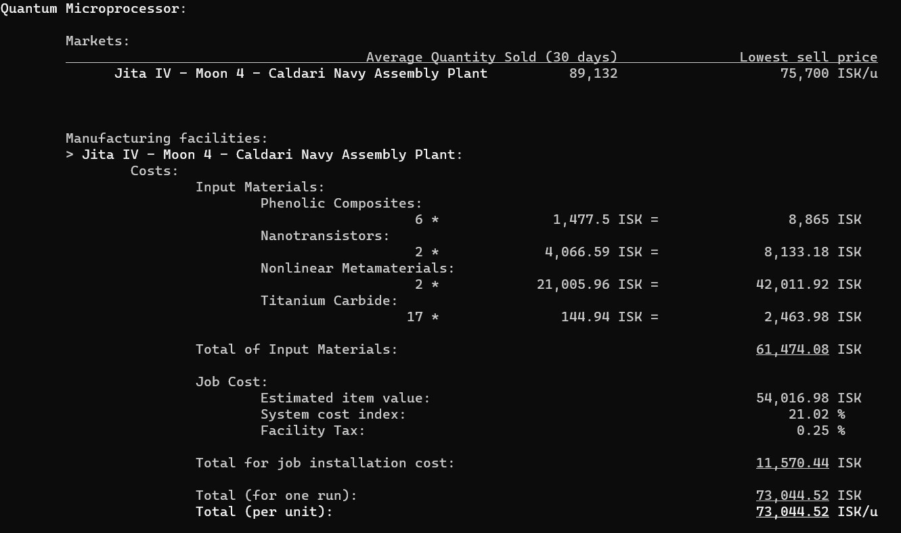
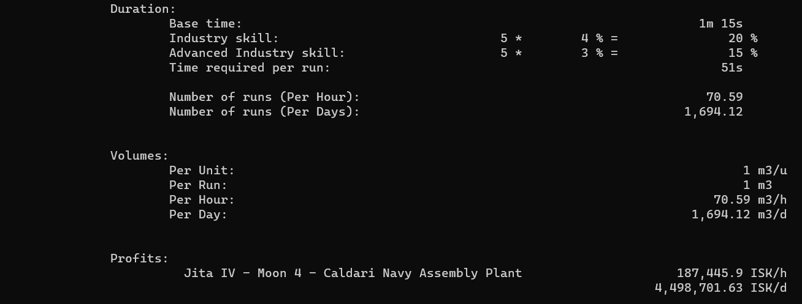
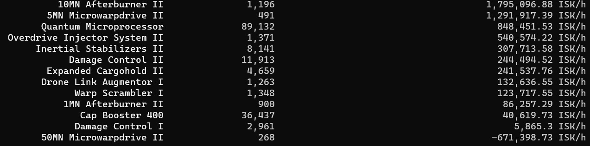

# Eve Vulcain
Eve Vulcain will help you to compute and plan industry activities in Eve Online. Based on preregistered industrial facilities and markets, as well as a preregistered list of items, it help you compare the profits you can make on different items.

_Manufacture specific item_

_Manufacture all registered items_

## Setup

## Usage

## Documentation